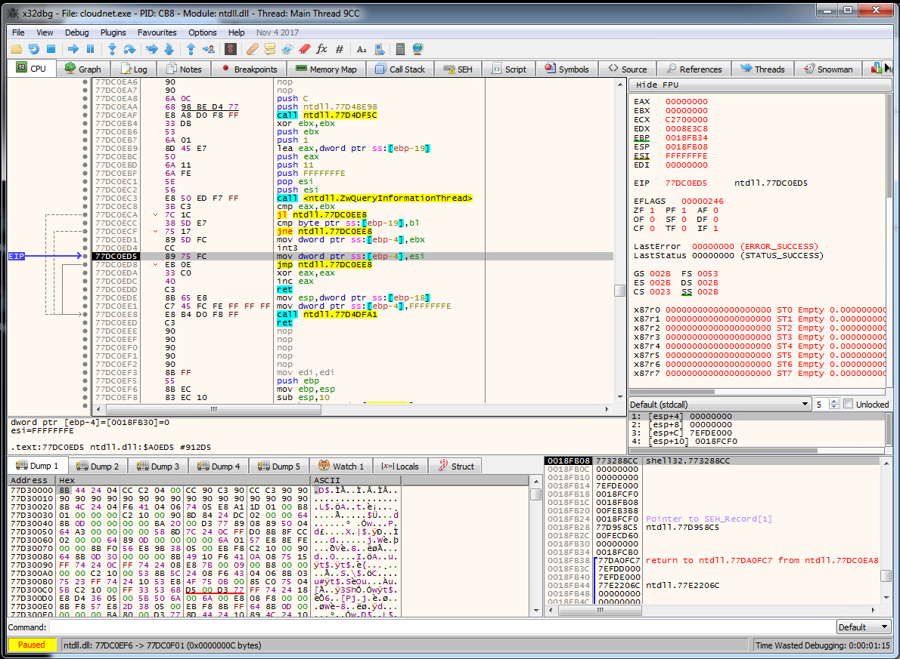
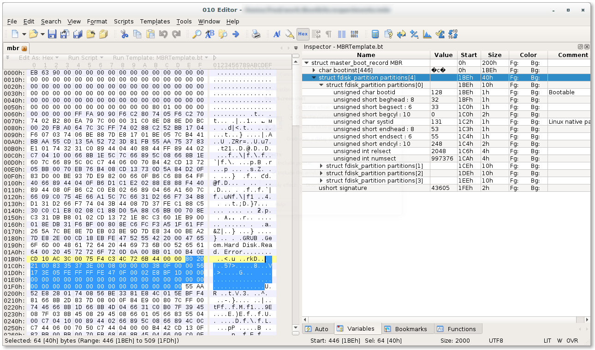
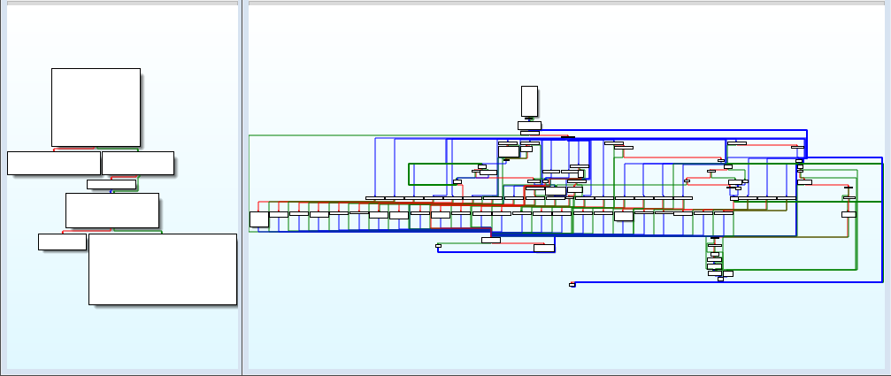
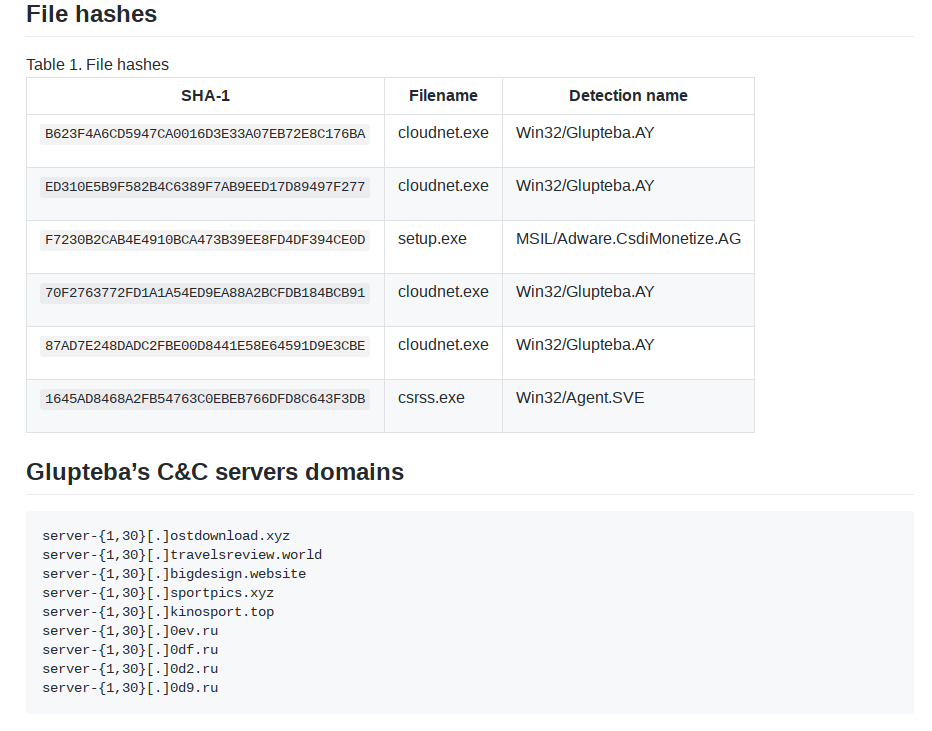
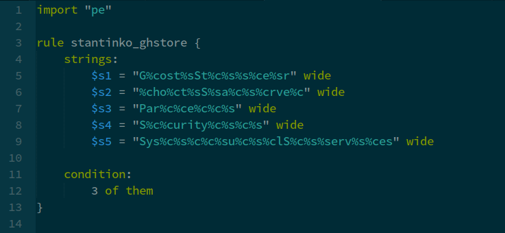
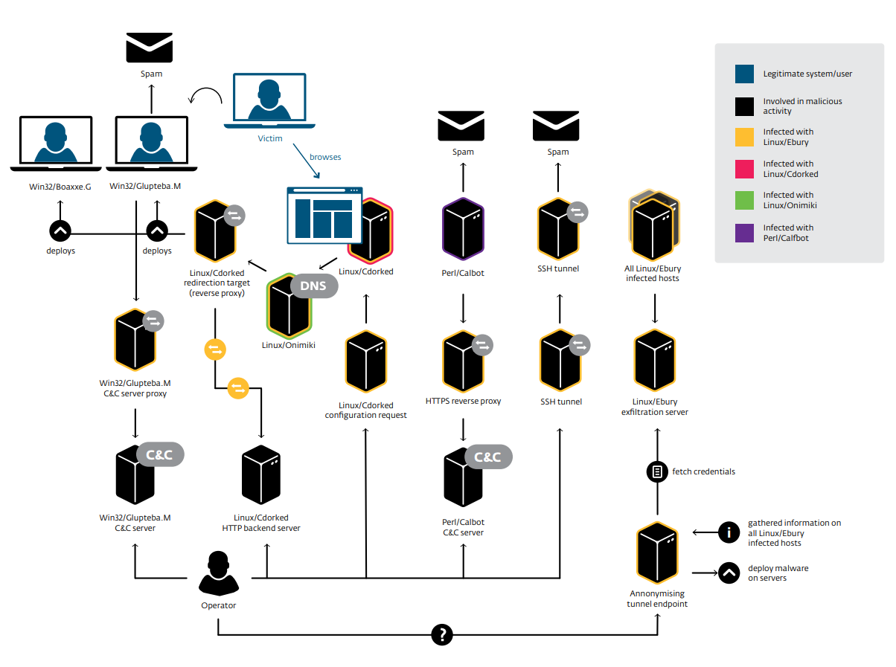
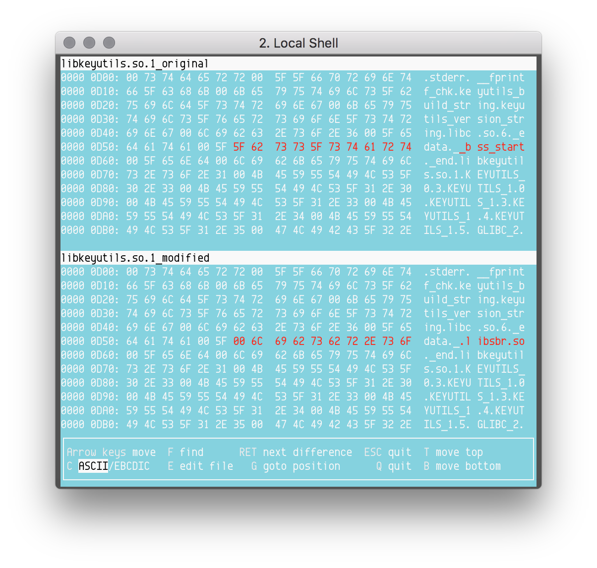

class: center, middle, inverse

# Recherche en logiciel malveillant

### Présenté par Frédéric Vachon

---

# Qui suis-je

## Frédéric Vachon

- Baccalauréat en Histoire (Université de Montréal)
- Baccalauréat en informatique et génie logiciel (UQAM)
- CTF: Rétro-ingénierie et exploitation binaire
- Dernier stage d'étude chez ESET
- Malware Researcher chez ESET

---

# Agenda

- Recherche en logiciel malveillant
  - Analyse / Rétro-ingénierie
  - Collection d'informations supplémentaires
  - Reconstruction de l'écosystème du logiciel malveillant
  - Partager des résultats
  - Traque et chasse
  - Pourquoi la recherche en logiciel malveillant ?
- Étude de cas
  - Ebury et l'opération Windigo
  - Enquête sur la dernière version d'Ebury

---

class: center, middle, inverse

# Introduction à la recherche en logiciel malveillant

---

class: center, middle, inverse

# Phase d'analyse

## Rétro-ingénierie

---

# Rétro-ingénierie

## Définir ce que l'on veut trouver
- Ne pas tout reverser
  - Binaires avec des centaines, voire des milliers de fonctions
  - Bibliothèques statiquement liées
- On cherche habituellement à
  - Comprendre les protocoles de communications
  - Extraire les serveurs de contrôle
  - Documenter les fonctionnalités

---

# Rétro-ingénierie

## Trouver ce que l'on cherche

- Gamme d'outils utiles pour la phase rétro-ingénierie
  - Analyse statique de code (IDA Pro, Binary Ninja, radare2, etc.)
  - Éditeurs hexadécimaux (010editor, HxD, hexer (?), etc.)
  - Outils pour analyse de format de fichiers exécutables
  - Débogueurs (WinDBG, x64dbg, ollyDbg, gdb, etc.)
  - Trace d'exécutions (procmon, API Monitor, strace, ltrace, etc.)
  - Capture réseau (Wireshark, tcpdump, etc.)

---

class: center
# IDA Pro


---

class: center, middle





---

class: center, middle
# 010editor




---

# Rétro-ingénierie

## Trouver ce que l'on cherche

- Analyse du code
- Regarder les fonctions importées
- Regarder pour des constantes
  - Algorithmes de chiffrement
  - Algorithmes de compression
  - Algorithmes d'encodage/décodage
- Déchiffrer les chaînes de caractères

---

# Rétro-ingénierie

## Trouver ce que l'on cherche

- Exécuter dans une sandbox
- Fournir l'environnement attendu par le logiciel malveillant
- Extraire les caractériques dynamiques
  - Trace d'appels aux APIs
  - Communication réseau
  - Interactions avec le système de fichier
  - Modification des clés de registres (Windows)

---

# Rétro-ingénierie

## Défis

- Plusieurs techniques rendent notre travail plus difficile
  - Packers
  - Obscurcissement du code (obfuscation)
  - Modules uniquement présents en mémoire
  - Machines virtuelles

---

# Rétro-ingénierie

## Packers

- Outil qui sert à compresser/chiffrer des binaires
- Objectifs
  - Réduire la taille d'un programme
  - Cacher le code malveillant
  - Rendre la détection plus difficile
  - Peut contenir des mécanismes d'anti-débogage/anti-émulation

---

# Rétro-ingénierie

## Obscurcissement du code

- Complexification superflue du code
- Rendre l'analyse du code plus difficile



---

# Rétro-ingénierie

## Machines virtuelles

- Logiciel qui exécute du code tiers
- Le code malveillant est contenu dans ce code tiers
- Architectures maison
- Difficultés
  - Plusieurs couches à reverser (machine virtuelle, code malveillant)
  - Pas d'outils pour analyser le code tiers
  - Demande beaucoup de temps
- Solutions professionnelles contre le piratage (VMProtect, Denuvo, etc.)

---

# Rétro-ingénierie

## Modules uniquement présents en mémoire

- Modules envoyés sur le réseau et directement chargés en mémoire
- Jamais écrit sur le disque
- Parfois envoyés sélectivement selon le profil des victimes
- Difficiles à obtenir
- Difficiles de savoir si on a tous les modules

---

# Collecter plus de données

## Information à collecter

- Dépend du type de malware
- Trafic réseau
- Modules présents en mémoire seulement
- Y a-t-il d'autres logiciels malveillants déployés sur les machines ?
- Y a-t-il plusieurs _stages_ ?

---

# Collecter plus de données

## Infecter des machines

- Pas approprié pour toutes les investigations
- Si possible, disposées dans plusieurs régions du monde
  - Permet de voir si le comportement varie selon le pays
  - Possibilité d'utiliser des VPNs (parfois bloqués)
- Monitorer la machine
  - Écriture de fichiers
  - Capture réseau
  - etc.

---

# Collecter plus de données

## Ensuite...

- Dépend de ce que l'on a collecté
- Analyse de trafic réseau
- Retour à l'étape rétro-ingénierie
  - Nouveaux modules
  - Nouveaux logiciels malveillants

---

# Reconstruire l'écosystème

- Chercher à comprendre comment tous les composants sont liés entre eux
- Rôles et liens entre les serveurs (serveurs compromis, proxy, etc.)
  - Pivoter sur des adresses IP
  - Pivoter sur des certificats
- Vecteur d'infection
- Objectifs
  - Monétisation
  - Espionnage
  - Sabotage ? 

---

class: center, middle, inverse

# Partager l'information

---
# Partager l'information

## Comment

- Publications
- Présentations dans des conférences
- Partage avec des groupes de confiance

---

# Partager l'information

## Quoi partager (IoCs)

- Indicateurs de compromission
  - Hash des fichiers malveillants
  - Domaines des serveurs de contrôle
  - Adresses IP
  - Clé de registres/fichiers spécifiques

---

class: middle, inverse



---

class: center, middle, inverse

# Traque et chasse 

---

# Traque et chasse

- Partie la plus importante du travail
- Traquer l'évolution de famille de logiciels malveillants
- Trouver des logiciels malveillants intéressants
  - Outils utilisés pour espionnage
  - Utilisation de techniques novatrices
  - Cibles intéressantes
  - Grande prévalence
  - Attaques par chaîne d'approvisionnement
  - etc.

---

# Traque et chasse

## YARA rules

- Système permettant d'exécuter des règles sur des flux de données
- Surtout utilisé dans la recherche en logiciel malveillant
- Écriture de règles basées sur des caractéristiques d'un fichier
  - Patterns textuels ou binaires
  - Conditions
- Modules permettant d'accéder à des attributs de formats exécutables 

---
class: middle, inverse
# Règle Yara



---

# Traque et chasse

## VirusTotal

- Plateforme publique qui permet l'analyse de fichiers pour détection
- Les fichiers sont stockés par la plateforme
- VirusTotal Intelligence
  - Permet de mettre des règles YARA sur ce flux de données
  - Permet de rechercher et télécharger les fichiers
  - Permet d'effectuer des _retrohunt_
- Très utilisé par les chercheurs (parfois comme unique source)

---

# Traque et chasse

## Données internes

- Dépends de l'organisation pour laquelle on fait de la recherche
- Utilisation des données internes
  - Requêtes dans les collections internes
  - Programmes d'échange d'échantillons
  - Utilisation d'outils internes


---

class: center, middle, inverse

# Pourquoi la recherche en logiciel malveillant ?

---

# Objectifs

## Rôle légal
  - Lutter contre des opérations de cybercriminalité
  - Collaboration avec forces de l'ordre

## Rôle défensif
  - Contribuer à rendre l'Internet plus sécuritaire
  - Permet aux organisations de mieux se protéger
  - Permet d'améliorer les produits de cyber sécurité

---

# Objectifs

## Rôle politico-social
- Certains organismes se spécialisent dans la défense de la société civil
  - Citizen Labs
  - Electronic Frontier Foundation
- Lutte contre espionnage envers la société civile
  - FinFisher
  - HackingTeam
- Défense de la liberté d'expression (censure, filtrage, etc.)


---

class: center, middle, inverse

# Étude de cas

---

# Ebury et l'Opération Windigo


- Opération ciblant les serveurs Linux et comprenant plusieurs composants
    - backdoor OpenSSH (Ebury)
    - Serveurs web trojanisés pour httpd, Nginx et lighttpd (CDorked)
    - Serveurs DNS compromis (Onimiki)
    - Autres composants pour envoyer des pourriels
- Ebury est le composant principal de l'opération
    - Récolte les informations d'identifications manipulées par OpenSSH
        - Nom d'usager / mot de passe
        - Clé privée

---



.footnote[Source: https://www.welivesecurity.com/wp-content/uploads/2014/03/operation_windigo.pdf]

---
# Ebury et l'Opération Windigo

## Collaboration avec le FBI

- Contribution d'ESET
  - Détails techniques sur l'opération et les composants malveillants
  - Témoignage en Cour
- Arrestation de Maxim Senakh à la frontière russo-finlandaise en août 2015
- Extradition vers les États-Unis en février 2016 
- Senakh plaide coupable
  - 46 mois de prison
  - Sans possibilité de libération conditionnelle

---
class: center, middle,


---

class: center, middle, inverse

# Analyse d'Ebury

---
# Analyse d'Ebury

## Début de l'enquête

- Hit sur VirusTotal début 2017
- Nouvelle version (1.5 -> 1.6)
- Analyse rapide
  - Beaucoup plus de code
  - Contient probablement de nouvelles fonctionnalités
- Décision de dédier du temps pour analyser la nouvelle version

---

# Analyse d'Ebury

## Nouvelles fonctionnalités

- Rootkit mode utilisateur pour cacher la bibliothèque d'Ebury
- Hook de la fonction `execve`
  - S'injecte dans les sous-processus via `LD_PRELOAD`
  - Roule dans le contexte de tous les programmes de la session SSH
- Hook de la fonction `readdir`
  - Enlève la bibliothèque d'Ebury de la liste de fichiers

---

# Analyse d'Ebury

## Nouvelles fonctionnalités

- Utilisation de DNS pour trouver son serveur de contrôle
- Algorithme de génération de domaine (DGA)
- Envoie une requête DNS pour l'entrée `TXT`
- L'entrée est signée par la clé privée des opérateurs
- Ebury contient la clé publique et peut vérifier la signature


### Entrées DNS pour le domaine larfj7g1vaz3y[.]net

```C
larfj7g1vaz3y[.]net.  1737  IN  A 78.140.134[.]7
larfj7g1vaz3y[.]net.  285   IN  TXT "ItTFyJ6tegXn9HkHa+XZX1+fZw0IsfhXl05phu1F7ZXDP4HtKMvrXW8NbUSjY8vkQgDdKsSaSCyrvfkhHodhVQLhIKJJY64HeoInb3m4SCNZNOhx9qjYRnuR0Ci7BHNWakJC/QdoQ4UNKkOrvvb42kN7TU6jqZCYBtusXd37tNg="
```

---

# Nouvelles fonctionnalités

### Entrée TXT déchiffrée
```C
larfj7g1vaz3y[.]net:3328801113:1517346000
```

- Vérification du domaine
- Contient l'adresse IP du serveur de contrôle
  - 3328801113 -> 0xc6697959 -> 198[.]105.121.89
- Date d'expiration
  - Unix timestamp
  - Permet de limiter l'impact de la réutilisation de l'entrée `TXT`
  - 1517346000 -> 2018-01-30 @ 9:00pm (UTC)

---
class: center, middle, inverse

# Mise en place d'un honeypot

---

# Mise en place d'un honeypot

- Déployer un serveur Linux avec un environnement réaliste
- Ne pas laisser de traces sur le serveur
- Utilisation du projet MITMproxy modifié
  - Backdoor activée avec une modification du protocole SSH
  - Modification de la bannière contenant la version de SSH

```C
--> <TCP SYN>
<-- <TCP SYN/ACK>
--> <TCP ACK>

--> SSH-2.0-fb54c28ba102cd73c1fe43
<-- SSH-2.0-OpenSSH_7.4p1 Debian-10+deb9u2

<Négociation de l'algorithme à utiliser>
<Échange de clés>
...
```

---

# Exfiltration d'informations d'identification

- Utilisation du mécanisme d'exfiltration d'Ebury
  - adresse IP de notre serveur
  - Nom d'utilisateur / Mot de passe
- Après environ un mois, les attaquants se sont connectés
- Capture du script de reconnaissance
- Capture du script de déploiement
- Nouvel échantillon d'Ebury
- Incapable de se connecter via la backdoor OpenSSH
- Notre honeypot n'est pas intégrée dans le botnet :'(

---

class: center, middle, inverse

# Mise en place d'un honeypot
## 2e tentative

---

# Mise en place d'un honeypot

- On doit encore modifier MITMProxy
- Nouveau mécanisme de sécurité
  - Authentification via clé RSA
  - Clé vérifiée dans l'environnement 
  ```C
  AuthorizedKeysFile /proc/self/environ
  ```
- On veut contourner ce mécanisme sans se faire prendre par le script de reconnaissance


---

# Mise en place d'un honeypot

- Recherche dans le manuel de `sshd_config`
- Ajout d'une entrée dans `/etc/sshd_config`
- `AuthorizedKeysCommand` a préséance sur `AuthorizedKeysFile`
- Permet de lancer une commande qui contient les clés publiques autorisées
- Le script de reconnaissance n'effectue pas de vérification pour cette commande
- On ajoute la clé de notre serveur de MITM via cette commande
- Déploiement, exfiltration des informations d'identification et attente...

---

# Mise en place d'un honeypot
## Connexion de l'attaquant

- Quelques semaines plus tard, l'attaquant se connecte
- Il parvient à se connecter via la backdoor OpenSSH
- Le script de reconnaissance lève 2 alertes

```C
ALERT!!! md5f trouble
5b2f6f20157c7aec198907ac8b95bec6  /usr/sbin/sshd
ALERT!!! md5f trouble
501e473e7c3ac60a04c7627e2d9bc09d  /usr/bin/ssh
```

---

# Connexion de l'attaquant

- Ces alertes attirent son attention et il vient vérifier le serveur
- Il passe environ 4 heures sur la machine
- Et s'aperçoit finalement du piège

```C
[root@dev .ssh]# cat /etc/ssh/cloud_key.sh
#!/bin/sh
cat /etc/ssh/cloud_key.pub

[root@dev .ssh]# cat /etc/ssh/cloud_key.pub
...
[root@dev ssh]# cat sshd_config
...
AuthorizedKeysCommand /etc/ssh/cloud_key.sh
AuthorizedKeysCommandUser root
...
[root@dev ssh]# echo hello ESET honeypot
hello ESET honeypot
[root@dev ssh]# exit
```
---
# Mise en place d'un honeypot
## La recherche continue

- Notre machine n'est pas intégrée dans le botnet, mais
  - On a de nouveaux échantillons
  - On a les scripts de reconnaissance et de déploiement
  - Et quelques autres informations...

---

class: center, middle, inverse

# Analyse du déploiement d'Ebury

---

# Analyse du déploiement d'Ebury

- `libkeyutils.so` est une bibliothèque chargée par plusieurs exécutables de la suite OpenSSH
  - client SSH
  - serveur SSH
- C'est cette bibliothèque qui est modifiée pour charger Ebury

---
# Analyse du déploiement d'Ebury

### Ajout d'une entrée dans une section de l'entête ELF


```diff
--- ./libkeyutils.so.1-5            2017-10-13 21:19:24.269521814 -0400
+++ ./libkeyutils.so.1-5.patched    2017-10-13 21:19:17.405092274 -0400
@@ -1,5 +1,5 @@
 
-Dynamic section at offset 0x2cf8 contains 26 entries:
+Dynamic section at offset 0x2cf8 contains 27 entries:
   Tag        Type                         Name/Value
  0x0000000000000001 (NEEDED)             Shared library: [libc.so.6]
  0x000000000000000e (SONAME)             Library soname: [libkeyutils.so.1]
@@ -26,4 +26,5 @@
  0x000000006fffffff (VERNEEDNUM)         1
  0x000000006ffffff0 (VERSYM)             0xdf0
  0x000000006ffffff9 (RELACOUNT)          3
+ 0x0000000000000001 (NEEDED)             Shared library: [libsbr.so]
  0x0000000000000000 (NULL)               0x0
```

---
# Analyse du déploiement d'Ebury

## Ajout d'une entrée dans une section de l'entête ELF

- Regardons en détail ce qui s'est passé
- Section `.dynamic` du format de fichier ELF
  - Contient les objets qui participent à la résolution dynamique des liens
  - Tableau de structures de type `Elf{32,64}_Dyn`

```C
typedef struct {
    Elf64_Xword d_tag;
    union {
            Elf64_Xword     d_val;
            Elf64_Addr      d_ptr;
    } d_un;
} Elf64_Dyn;
```

---
# Analyse du déploiement d'Ebury

## Ajout d'une entrée dans une section de l'entête ELF

- Deux étapes nécessaires
  - Ajout d'une entrée dans le tableau de `Elf64_Dyn`
  - Entrée de type `DT_NEEDED` qui spécifie une dépendance
  - Trouver une place pour stocker la chaîne de caractères 'libsbr.so'
- La chaîne de caractères est stockée dans la table des symboles `.dynsym`
- Un symbole inutilisé est remplacé
  - `__bss_start`
  - Sert à obtenir un pointeur sur le début de `.bss`

---
class: center, middle, inverse

---
class: center, middle, inverse

---
# Visualisation de l'entête ELF

```C
                       +-------------+
                       | "\x7fELF"   |
                       +-------------+
                       |   sections  |
                       +=============+
                       |  .dynamic   |
                       |-------------|
                       |     ...     |
                       +-------------+
                       |  DT_NEEDED  | Entrée Elf64_Dyn
                    +--|  OFFSET     | 
                    |  |-------------|
                    |  |     ...     |
                    |  |=============|    
                    |  |   .dynsym   |
                    |  |-------------|
                    |  |     ...     |
                    |  |-------------| 
                    +->| "libsbr.so" |
                       |-------------|
                       |    ...      |
                       |=============|
                       |             |
                       |             |

```

---

# Résultats

- Documenter les nouvelles fonctionnalités
    - Rootkit mode utilisateur
    - Mécanisme de mitigation anti-sinkhole
    - Renforcement du mécanisme d'authentification
- Partage de nouveaux IoCs
    - Empreintes d'échantillons d'Ebury (SHA-1)
    - Adresse IP d'un serveur de contrôle
    - Etc.

---
class: middle, center, inverse
# Conclusion
